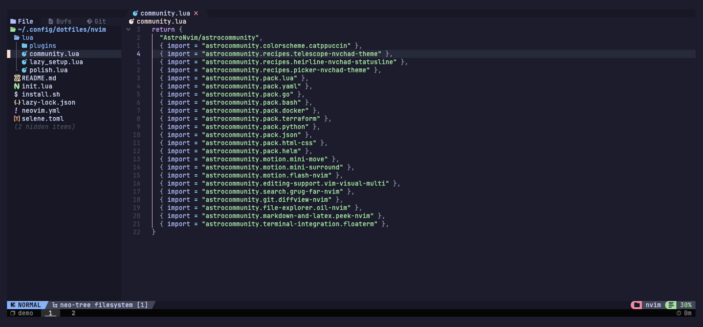
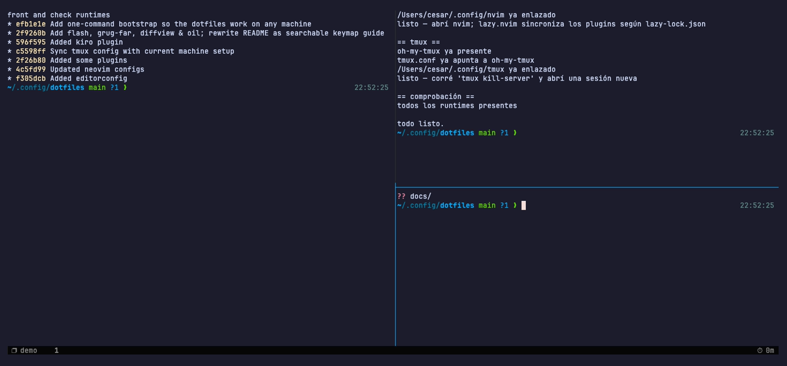

# dotfiles

Configuración de **Neovim** (AstroNvim v5) y **tmux** (oh-my-tmux), pensada para
levantarse en cualquier máquina con un solo comando.

## Cómo se ve

Neovim (AstroNvim + catppuccin) con el explorador de archivos abierto, corriendo
dentro de tmux:



tmux con la barra de estado de oh-my-tmux y tres paneles — historia de git, el
instalador y el estado del repo:



Las dos capturas se generan solas desde [`docs/demo.tape`](docs/demo.tape), así
que se pueden rehacer cuando cambie la config:

```shell
brew install vhs
vhs docs/demo.tape
```

Usa los symlinks que dejó `install.sh`, o sea que refleja lo que hay commiteado
acá. Corre tmux sobre un socket propio (`-L vhs`) para no tocar tus sesiones.

## Requisitos

### Antes de empezar

Lo único que tenés que tener sí o sí para arrancar:

| Requisito | Por qué |
| --- | --- |
| **git ≥ 2.19** | Para clonar el repo, y porque lazy.nvim usa *partial clone* (`--filter=blob:none`). |
| **Terminal con true color y una Nerd Font activa** | La barra de estado y los iconos de Neovim los necesitan; sin la fuente se ven cuadraditos. |
| **`TERM=xterm-256color`** fuera de tmux | Lo pide oh-my-tmux para que los colores salgan bien. |
| **awk, perl, grep, sed** | Los usa oh-my-tmux. Vienen de fábrica en macOS y en cualquier Linux. |
| **`brew` o `apt-get`** | Solo si querés que `install.sh` instale las dependencias. Sin ninguno de los dos, avisa y las instalás a mano. |

### Lo que instala `./install.sh` por vos

| Paquete | Para qué |
| --- | --- |
| `neovim` **≥ 0.10** | AstroNvim v5 aborta con una versión anterior. |
| `tmux` **≥ 2.6** | Es el mínimo que pide oh-my-tmux. |
| `git` | Ver arriba. |
| `ripgrep` (`rg`) | grug-far y el live grep de Telescope. |
| `fd` | Acelera la búsqueda de archivos. |
| `lazygit` | TUI de git (`<Leader>gg`). No está en apt: en Debian/Ubuntu se instala aparte. |
| JetBrainsMono Nerd Font | Solo en macOS vía brew, y solo si no detecta ninguna Nerd Font instalada. |

> **Ojo con Neovim en Linux:** el `apt` de las distros estables suele traer una
> versión anterior a 0.10, con la que AstroNvim no arranca. `install.sh` verifica
> la versión y avisa; si no cumple, usá el binario de
> [releases de Neovim](https://github.com/neovim/neovim/releases), un PPA o brew.

### Runtimes que necesitan los plugins

Estos **no se instalan solos a propósito**: normalmente los manejás con nvm,
pyenv o goenv, y meterlos por brew/apt pisaría esa configuración. `install.sh`
solo comprueba si están y te dice qué te falta.

Todo lo que no tengas simplemente no funciona; el resto del editor anda igual.

| Runtime | Qué deja de funcionar sin él |
| --- | --- |
| **node** / npm | Los LSP que Mason instala por npm: bash, json, yaml, html/css, docker, emmet y `prettierd`. |
| **go** | `gopls`, `delve`, `goimports` y el resto del pack de Go (Mason los compila con `go install`). |
| **python3** + pip | `debugpy`, `black`, `isort`. |
| **deno** | `peek.nvim`, el preview de markdown (su `build` corre `deno task`). |
| **Compilador de C** (`cc`/`gcc`/`clang`) | Compilar los parsers de treesitter. En macOS viene con las Xcode Command Line Tools (`xcode-select --install`); en Debian/Ubuntu, `build-essential`. |
| `curl`, `unzip`, `tar` | Mason los usa para bajar y descomprimir los binarios preconstruidos. Suelen venir de fábrica. |

En Linux, para que funcione el portapapeles del sistema en Neovim hace falta
`xclip` (X11) o `wl-clipboard` (Wayland).

## Instalación

```shell
git clone git@github.com:cesarbqz/dotfiles.git ~/.config/dotfiles
cd ~/.config/dotfiles
./install.sh
```

El repo puede vivir en cualquier ruta (`~/dotfiles`, `~/code/dotfiles`, …): los
enlaces se calculan desde la ubicación real del script.

`./install.sh` hace cuatro cosas, y es seguro re-ejecutarlo:

1. **Instala las dependencias** que falten con `brew` o `apt-get` (la segunda
   tabla de arriba). Con `--no-deps` se saltea este paso y no se toca el gestor
   de paquetes.
2. **Enlaza** `~/.config/nvim` y `~/.config/tmux` a los directorios de este repo.
   Si ya había una config real ahí, se mueve a `<nombre>.bak-<timestamp>`; nunca
   se borra nada.
3. **Instala oh-my-tmux** en `~/.local/share/tmux/oh-my-tmux` y genera
   `tmux/tmux.conf` apuntando a él.
4. **Comprueba** la versión de Neovim y qué runtimes te faltan, sin instalarlos.

Después: abrí `nvim` (lazy.nvim sincroniza los plugins según `lazy-lock.json` y
Mason instala los LSP) y corré `tmux kill-server` antes de abrir una sesión nueva.

Cada herramienta tiene su instalador suelto (`nvim/install.sh`, `tmux/install.sh`)
por si querés enlazar solo una.

## Qué hay acá

| Ruta | Qué es |
| --- | --- |
| `nvim/` | Config de AstroNvim v5. Atajos documentados en [nvim/README.md](nvim/README.md). |
| `nvim/lua/community.lua` | Packs de lenguaje activos: Lua, YAML, Go, Bash, Docker, Terraform, Python, JSON, HTML/CSS, Helm. Son los que definen qué runtimes te hacen falta. |
| `nvim/lazy-lock.json` | Versiones exactas de los plugins. Commiteálo para que todas las máquinas queden iguales. |
| `tmux/tmux.conf.local` | Tus personalizaciones de oh-my-tmux (tema, barra de estado, plugins). |
| `tmux/scripts/` | Scripts que usa la barra de estado. |

## Qué no se versiona

- `tmux/tmux.conf` — es un symlink con ruta absoluta al oh-my-tmux de cada
  máquina, así que lo genera `tmux/install.sh`. Tiene que ser un symlink al
  archivo real (no un `source-file`): oh-my-tmux ejecuta el propio `tmux.conf`
  como script para gestionar sus plugins.
- `tmux/plugins/` — ahí clona oh-my-tmux sus plugins (tpm, resurrect, …).

## Mantenerse sincronizado

```shell
cd ~/.config/dotfiles && git pull && ./install.sh
```

Al cambiar plugins de Neovim, commiteá `lazy-lock.json` junto con el cambio.

## Detalles a tener en cuenta

- Si existe `~/.tmux.conf`, tmux le da prioridad y esta config queda ignorada.
  El instalador avisa.
- `tmux.conf.local` llama a `scripts/session_age.sh` por la ruta fija
  `~/.config/tmux/...`, porque el parser de tmux rechaza `${XDG_CONFIG_HOME}`
  dentro de un `#()`. Con un `XDG_CONFIG_HOME` no estándar el contador de la
  barra queda vacío y el resto anda igual; el instalador también avisa.
